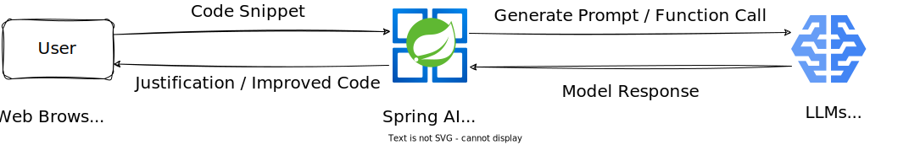

# Spring AI Code Review

This technical demonstration explores Spring AI Framework's integration with Gemini Pro Model, for code review automation. Pre-defined prompts guide Gemini through various code analysis aspects like security, logic, performance, and style adherence. This approach aims to facilitate consistent and efficient code review workflows. Users access the application through a standard web browser, where their interactions are transmitted to the Spring application server. This server acts as the bridge, processing user requests and interacting with the AI model via its APIs.

## Architecture

The Srping application implements a novel multi-agent architecture for intelligent code assessment. A team of specialized AI agents works together to analyze different aspects of the code. These agents can identify security vulnerabilities, assess logic flow for correctness, evaluate performance efficiency, and ensure adherence to style guides.

This distributed approach offers several advantages. By focusing on specific tasks, each agent can leverage its expertise to provide deeper insights. Additionally, by dividing the review process into smaller, targeted prompts, the application overcomes limitations on token length and context window commonly encountered in large language models.

The combined analysis from these agents generates a comprehensive code review, complete with justifications for identified issues and suggestions for improvement. This can significantly improve the quality and efficiency of the code review process, leading to the delivery of high-quality code.

* **Security Assessment Agent:**
    * Identifies potential security vulnerabilities and secret leaking.
    * Integrates with external security databases to detect vulnerabilities.
    * Examples: SQL injection, cross-site scripting (XSS), insecure memory access.
* **Logic Assessment Agent:**
    * Evaluates code logic and structure.
    * Analyzes control flow, data structures, and best practice adherence.
    * Identifies areas like redundant code, inefficient algorithms, or logical errors.
* **Performance Assessment Agent:**
    * Analyzes code performance characteristics.
    * Uses techniques like profiling or simulation.
    * Assesses factors like execution time, memory usage, and resource efficiency.
* **Quality Assessment Agent:**
    * Enforces code style for better maintainability and collaboration.
    * Ensures adherence to a style guide for consistent formatting and commenting.
    * Integrates with external style checkers for custom conventions.
* **Summarization Agent:**
    * Collects findings from individual assessment agents.
    * Condenses information into a concise summary highlighting critical issues.
* **Improvement Agent (Future):**
    * Focuses on generating an improved version of the code snippet.
    * Leverages insights from other agents and style guide to suggest modifications.
    * Addresses security concerns, improves logic and efficiency, and enhances readability.

## Spring AI Integration

Spring AI's framework provides Chat Completion API and Function Call API. These built-in tools guide the AI model to focus specifically on the task of code review. This streamlines the process and ensures the model delivers the most relevant and helpful insights.
